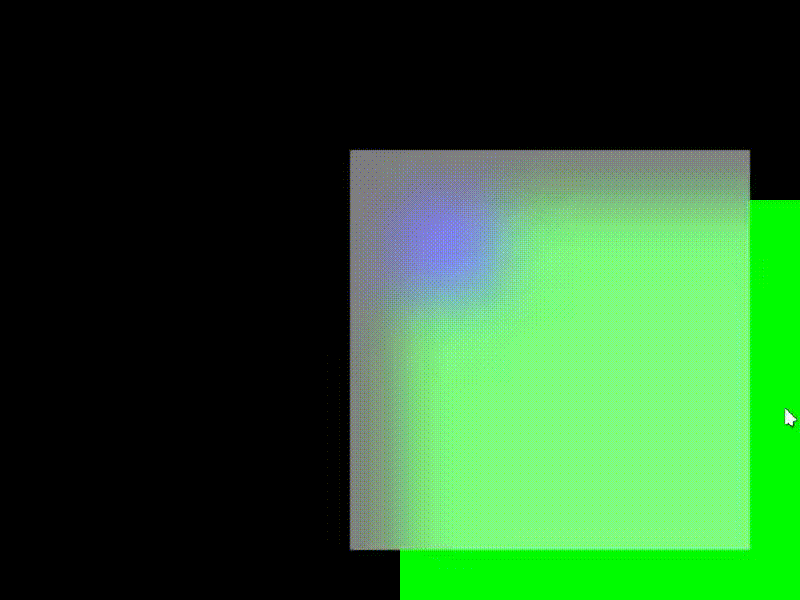

# winia
基于winit和skia的跨平台GUI库，任处于早期开发阶段。
页面构建代码类似于：
```rust
fn main() {
    run_app(
        App::new(main_ui)
            .title("Example")
            .preferred_size(800, 600)
    );
}
fn main_ui(app: AppContext, property: AppProperty) -> Item {
    let size = SizeProperty::from(100.0);
    let margin_start = F32Property::from(150.0);
    let margin_top = F32Property::from(50.0);
    let vertical_gravity = Property::from(Gravity::End);
    let horizontal_gravity = Property::from(Gravity::End);

    app.stack(Children::new() +
        app.stack(Children::new() +
            app.rectangle()
                .color(Color::BLUE)
                .item().width(Size::Fixed(100.0)).height(Size::Fixed(100.0))
                .on_click(func!(|property|, move|_|{
                    println!("Blue rectangle clicked");
                    property.title().set("Blue rectangle clicked".to_string());
                    property.maximized().set(property.maximized().get().not())
                })) +
            app.rectangle()
                .color(Color::WHITE).item()
                .width(&size).height(&size)
                .margin_start(&margin_start).margin_top(&margin_top)
                .enable_background_blur(true)
                .opacity(0.5)
                .on_click(func!(|app, size, margin_start, margin_top, offset|, move|_|{
                    app.animate(Target::Exclusion(Vec::new()))
                    .transformation(func!(|size, margin_start, margin_top, offset|,move|| {
                        if let Size::Expanded = size.get() {
                            size.set(Size::Fixed(100.0));
                            margin_start.set(150.0);
                            margin_top.set(50.0);
                            offset.set(0.0);
                        } else {
                            size.set(Size::Expanded);
                            margin_start.set(0.0);
                            margin_top.set(0.0);
                            offset.set(-50.0);
                        }
                    })).duration(Duration::from_secs(5)).start();
                }))
        ).item()
            .width(Size::Fixed(400.0))
            .height(Size::Fixed(400.0))
            .horizontal_gravity(&horizontal_gravity)
            .vertical_gravity(&vertical_gravity)
            .background(
                app.rectangle()
                    .color(Color::GREEN)
                    .item()
            )
            .on_click(func!(|app, horizontal_gravity, vertical_gravity|, move|_|{
                app.animate(Target::Exclusion(Vec::new()))
                    .transformation(func!(|horizontal_gravity, vertical_gravity|,move|| {
                    if horizontal_gravity.get() == Gravity::Start && vertical_gravity.get() == Gravity::Start {
                        horizontal_gravity.set(Gravity::End);
                    }else if horizontal_gravity.get() == Gravity::End && vertical_gravity.get() == Gravity::Start {
                        vertical_gravity.set(Gravity::End);
                    }else if horizontal_gravity.get() == Gravity::End && vertical_gravity.get() == Gravity::End {
                        horizontal_gravity.set(Gravity::Start);
                    }else {
                        vertical_gravity.set(Gravity::Start);
                    }
            })).duration(Duration::from_secs(1)).start();
        }))
    )
        .horizontal_gravity(&horizontal_gravity)
        .vertical_gravity(&vertical_gravity)
        .item()
        .width(Size::Expanded)
        .height(Size::Expanded)
        .padding_start(10.0)
        .padding_top(10.0)
        .name("root")
}
```
运行效果如下：

