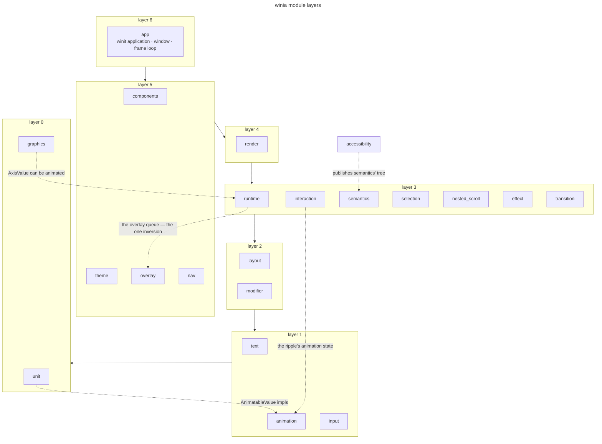
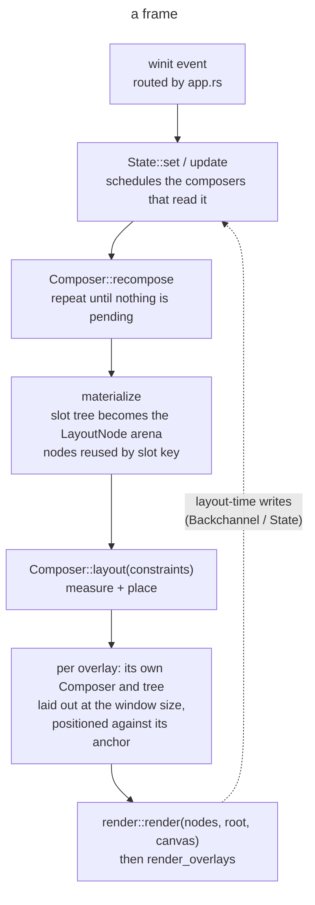
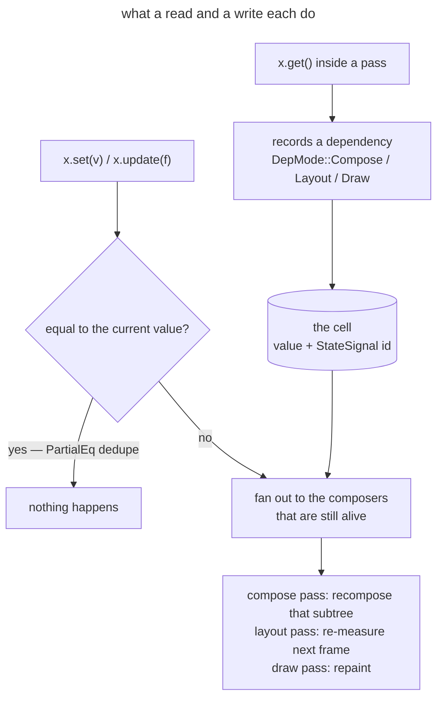
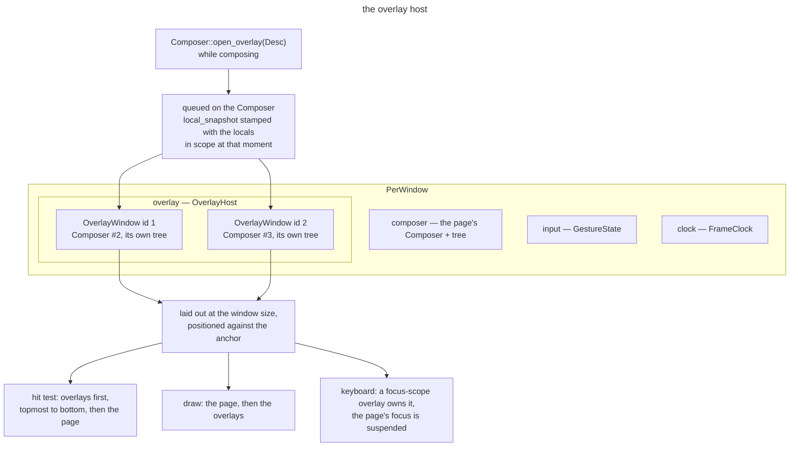

# Winia — architecture

Winia is a declarative GUI framework for Rust. `winit` owns the window and the event loop,
`skia-safe` does the drawing, and everything between the two is modelled on Jetpack Compose:
composition over a slot table, an incremental recompose loop, an immutable `Modifier` chain, and a
`Constraints → Measure → Place` layout pass.

This document describes the tree as it is. For how the rewrite was planned, and for the decisions
taken along the way, see [`v2-design-notes.md`](v2-design-notes.md) — a dated record.

- crate `winia` 0.2.0, edition 2024
- `winit` 0.31.0-beta.3, `skia-safe` 0.99.0

## Workspace

| crate | what it is |
| --- | --- |
| `winia` | the framework: runtime, layout, components, renderer, app |
| `winia-macros` | the two attribute macros (`composable`, `composable_keyed`) and the four function macros (`app_root!`, `run_app!`, `compose!`, `keyed_stmt!`) a caller uses |
| `skiwin` | window creation and the Skia surface: Vulkan → GL → CPU/softbuffer, first that opens wins |
| `material-shapes` | Material 3 shape geometry (the morphing used by `MaterialShapes`) |

`winia` depends on the other three by path. Nothing depends on `winia`.

## Layers



The tree is layered, but not strictly: a module may name the ones below it freely, and a handful of
edges do point up. One rule **is** enforced, because breaking it would mean a lower layer drifting
into the component model — `layout`, `runtime`, `modifier`, `interaction`, `input`, `selection`,
`semantics`, `accessibility`, `unit`, `text`, `render`, `animation`, `graphics` and `transition` must
not name `components`, `theme`, `app` or `overlay` in production code. There is exactly one exception,
the overlay queue below.

| layer | modules | what lives there |
| --- | --- | --- |
| 0 | `unit` | `Dp`, `Sp`, `Px`, `Density`, `Offset`, `Size`, `TextUnit` |
| 0 | `graphics` | `Color`, `Shape`, `Brush`, `ContentScale`, the icon/image payloads, `skia_color` |
| 1 | `text` | font faces, `TextStyle`, paragraph building and caching, `TextField`'s text engine, selection |
| 1 | `animation` | `Animatable`, specs, interpolators, `AnimatedVisibility`'s vocabulary |
| 1 | `input` | the pointer and keyboard event vocabulary, the gesture state machine |
| 2 | `layout` | `Constraints`, `LayoutNode` and its arena, `MeasurePolicy`, `Column`/`Row`/`Stack`/`Flow`, lazy lists, subcomposition |
| 2 | `modifier` | the `Modifier` chain: what it is, how it is walked, what each element means |
| 3 | `runtime` | `Composer`, the slot table, `ComposeCtx`, `State` and its handles, composition locals, materialization |
| 3 | `interaction`, `semantics`, `selection`, `nested_scroll`, `effect` | the interaction source, the accessibility tree, text selection, nested-scroll plumbing, effects |
| 3 | `transition` | the shared-element machinery: flights, bounds, the measure override |
| 4 | `render` | walking the arena onto a Skia canvas |
| 5 | `components`, `theme`, `overlay`, `nav` | the 51 components, the M3 theme, the overlay runtime, Navigation 3 |
| 6 | `app` | the winit application, the window, the frame loop |
| — | `debug`, `accessibility`, `anim_trace`, `icon` | the dev-server channel, the UIA bridge, the frame trace, the icon tables |

The edges that go up, and why each is there:

| edge | what it is |
| --- | --- |
| `runtime` → `overlay` | the overlay queue — the one sanctioned inversion, below |
| `unit` → `animation` | `impl AnimatableValue for Dp/i32/Sp/Offset/Size`: the unit types say how they interpolate, which is the alternative to `animation` knowing every unit type |
| `graphics` → `runtime` | `impl From<&Animating<f32>> for AxisValue` — a variable-font axis can be animated, so `graphics` has to name the handle |
| `interaction` → `animation`, `runtime` | `MutableInteractionSource` drives the ripple's animation state |
| `accessibility` → `semantics` | the UIA bridge publishes the tree `semantics` builds; the frame loop fills the snapshot once per rendered frame |
| `layout` → `text` | a paragraph's measured size is a constraint input |
| `modifier` → everything at layer ≤ 3 | the chain is what a caller attaches to any of them |

`text` is the one module whose *facade* (`text.rs`) has no dependencies at all: the submodules do
the naming (`text/field.rs` reaches `layout` and `modifier`, because a text field is a measure-time
policy as well as a text engine).

### The one inversion

`runtime` names `crate::overlay::OverlayDesc` in three places: `ComposeCtx::open_overlay` queues one,
`Composer` holds the queue, and `Composer::take_overlays` hands it to the frame that hosts it. The
record is the overlay layer's — `PopupPosition`, `OverlayAnimSpec`, the dismissal flags — and the
runtime does exactly one thing to it: it stamps `local_snapshot` with the composition locals captured
at the call site, because an overlay composes in its own `Composer` after those providers have
popped and cannot read the main tree's theme or direction otherwise. Moving the record down to
satisfy the direction would take `PopupPosition`, `OverlayAnimSpec` and the four presentation helpers
with it, which places five things worse than it fixes one. The edge is deliberate and narrow.

## The module tree

"Lines" below is production code: the file minus whatever `#[cfg(test)] mod …` blocks it carries.

| module | production lines | holds |
| --- | --- | --- |
| `runtime/` | 7 submodules | `composer.rs` (7.0k), `materialize.rs`, `state.rs`, `composition_local.rs`, `state_list.rs`, `density.rs`, `lifecycle.rs` |
| `layout/` | 15 submodules | `node.rs` (the arena), `constraints.rs`, `flex.rs` + `column.rs`/`row.rs`/`flow.rs`, `lazy_column.rs`, `components.rs` (`Column`/`Row`/`Stack`/`Spacer`/`Flow*`), `subcompose.rs`, `box_with_constraints.rs`, `adaptive.rs`, `axis.rs`, `direction.rs`, `sizing.rs` |
| `components/` | 51 files, flat | one file per component (`button.rs`, `text_field.rs`, `date_picker.rs`, …) plus `components.rs`, the facade |
| `modifier.rs` | 3.0k | `Modifier`, `ModifierElement`, the node traits |
| `render.rs` | 2.3k | the arena walk, layers, clips, per-element painting |
| `app/` | 4 submodules | `app.rs` (3.4k — the loop and the routing), `window.rs`, `overlay_host.rs`, `gesture.rs`, `scroll.rs` |
| `graphics/` | 4 submodules | `color.rs`, `shape.rs`, `layer.rs`, `brush.rs` |
| `text/` | 11 submodules | `font.rs`, `style.rs`, `paragraph.rs`, `text_layout.rs`, `field.rs`, `selection.rs`, `transformation.rs`, `decor.rs`, `inline_drawable.rs`, `index_bimap.rs` |
| `nav.rs` | 2.0k | Navigation 3: back stack, scene transitions |
| `transition.rs` | 1.0k | flights, `SharedBounds`, the measure override, overlay clips |
| `theme.rs` | 753 | `WiniaTheme`, `ThemeColors`, `Typography`, `WindowTheme`, `AppliedTheme` |
| `semantics.rs` | 862 | the accessibility tree and its JSON |
| `accessibility.rs` | 1.3k | the Windows UIA bridge (feature `accessibility`) |
| `overlay.rs` | 597 | the overlay runtime: `Popup`, `Dialog`, `OverlayDesc` |
| `animation/` | 2 submodules | `animation.rs` (the facade), `interpolator.rs`, `visibility.rs` |
| `unit.rs`, `interaction.rs`, `nested_scroll.rs`, `effect.rs`, `selection.rs`, `debug/`, `icon/`, `anim_trace.rs` | | as the layers table says |

## A frame



The whole loop is `PerWindow::recompose_layout_render` in `app.rs`.

1. **Event.** winit delivers a `WindowEvent`; `app.rs` routes it — pointer and key into
   `app/gesture.rs`, wheel and drag into `app/scroll.rs`, and anything that lands on an overlay into
   `app/overlay_host.rs`. A routed event usually writes a `State`, which is what schedules the rest.
2. **Compose.** `Composer::recompose` runs the pending recompositions and repeats until no state is
   left pending — a compose that dirties another composable is not a second frame.
3. **Materialize.** The slot tree becomes the `LayoutNode` arena: slots are reused by stable key,
   nodes that left the tree run their `on_remove`, and descriptions are turned into nodes.
4. **Layout.** `Composer::layout(constraints)` measures and places the arena from the root.
5. **Overlays.** Each overlay is its own `Composer` and its own tree, laid out at the window's size,
   positioned against its anchor, and hit-tested before the page.
6. **Draw.** `render::render(nodes, root, canvas)` walks the arena and paints. Overlays draw on top,
   through `render_overlays`.
7. **Read back.** State written during layout (a size the parent needs, a scroll extent) is read by
   the next frame's compose through the dependency frames below.

Density is provided for the whole pass: `runtime::density::with_density` wraps compose, layout and
draw so that `Dp`/`Sp`/`Px` resolve against the window's scale factor rather than the standard 1.0.

## The composition runtime

`Composer` (`runtime/composer.rs`) owns the slot table, the recomposition queue, the dependency
maps, and the node arena. `ComposeCtx` is the handle a `#[composable]` body uses: `remember`,
`next_key`, `start_restartable_group`, `compose`, `layout`, the providers.

**The slot table** is the tree of positions. A composable's call site and its keys identify a slot;
a value remembered in that slot survives recomposition, and a slot that disappears runs its
teardown. `composable_keyed` and `keyed_stmt` are how a loop says which key identifies each
iteration — without them, inserting at the front of a list re-associates every slot below it.

**Materialization** (`runtime/materialize.rs`) turns the composed description tree into the
`LayoutNode` arena the layout and the renderer use. Reuse happens here: a node whose slot key is
unchanged keeps its identity, so measure caches and animation state survive.

**Composition locals** (`runtime/composition_local.rs`) are the implicit context: theme, layout
direction, density, text style. A provider pushes a value for its subtree; a reader asks for the
current one. Values are captured in the tree, never read from a global at draw time.

**Dependency frames** are what makes recomposition incremental. A read inside a compose pass records
a dependency on that `State`; a write schedules exactly the subscribers that read it. Three modes
exist — compose, layout, and draw — and `begin_*_deps_with_queue` is how a pass declares what its
reads should subscribe.

## State



A write never names a channel: it goes through the cell's `StateSignal` and reaches exactly the
composers that read it. What a write *does* when it arrives is the handle's whole contract:

| handle | a read | a write |
| --- | --- | --- |
| `State<T>` / `Reactive<T>` | subscribes | recompose **and** wake the event loop |
| `Animating<T>` | subscribes | recompose only — the animation engine already asked for the frame |
| `Visual<T>` | `peek`, no subscription | no recompose; the renderer reads it while drawing |
| `Backchannel<T>` | `peek` | nothing; the next frame reads what was written |

`runtime/state.rs`. A `State<T>` is an observable cell. Creation is **ownerless**: `State::new` is
not bound to a composer, and `get()` is what subscribes the current pass. That is why a component can
build a state in its constructor and hand it out without threading a composition context through.

`StateList`/`StateMap` (`runtime/state_list.rs`) are the observable collections behind
`mutableStateListOf`/`mutableStateMapOf`; they hand out snapshots so an iteration cannot observe a
mutation mid-loop.

## Modifier

`modifier.rs`. A `Modifier` is an immutable chain: every builder returns a new one, and
`left to right` is `outer to inner`. The chain is a `Vec<ModifierElement>`, an enum whose variants
carry the payload — `Layout`, `Draw`, `TextContent`, `TextFieldVisual`, `Background`, `GraphicsLayer`,
and the rest.

Elements are interpreted by kind, through the node traits: `DrawNode` and `DrawWrapNode` for
painting, `ClickNode`/`PointerNode`/`KeyNode` for input, `LayoutModifierNode` for a measure-time
transformation. A node trait's `measure` receives the constraints and returns the child's; `draw`
receives the canvas and the node's rect. Both are called while walking the arena, so a modifier never
allocates an object per frame to be honoured.

`LayoutWeight` and baselines are the two places where a child needs information from its parent
across the chain: `layout_weight` records intent and the flex policy reads it, `align_by` records an
alignment line and the container reads it after measuring.

## Layout

`layout/node.rs` is the arena, `layout/constraints.rs` the constraint algebra, and the primitives
follow Compose's three phases:

```rust
fn measure(&self, nodes: &mut Vec<LayoutNode>, policies: &[Box<dyn MeasurePolicy>],
           children: &[usize], constraints: Constraints) -> (Size, Vec<Placement>);
fn place(&self, nodes: &mut Vec<LayoutNode>, children: &[usize], placements: &[Placement]);
```

`MeasurePolicy` is implemented by every container. `Column` and `Row` are the same algorithm
parameterised by `axis::Axis` — which physical axis is the main one, and where a size's main extent
lives — so the two share one measure pass; `Flow` adds line breaking, `Stack` a z-ordered overlay.
`LazyColumn`/`LazyRow` compose only the items near the viewport and reuse the height they measured.

`subcompose.rs` is `SubcomposeLayout`: composing during measurement, with the constraints the pass
just produced. That is what lets a component choose content by measured space (`BoxWithConstraints`,
the lazy list's window, `TabRow`'s indicator).

## Drawing

`render.rs` walks the arena from the root. For each node it applies the clip and the graphics layer,
paints the background/border/shadow the modifier chain describes, paints the content, and recurses
into children. `graphics/` holds the values it consumes: `Color`, `Shape`, `Brush`, the graphics
layer parameters, the icon and image payloads, and the one conversion to `skia_safe::Color`.

Text is drawn by the text layout (`text/text_layout.rs`), which caches shaped paragraphs keyed on
content and style, so a frame that does not change text does not re-shape it.

## Components

`components/` is flat: 51 files, one per component or component family, plus `components.rs`, which
declares them and re-exports the names the prelude uses. A component is a builder plus a
`#[composable]`-annotated `build(ctx, content)`. Conventions, uniform across the directory:

- a `XDefaults` type holds the token values (`ButtonDefaults::shape()`, `…::button_colors(&theme, style)`),
  with `pub const` names for the sizes and paddings material3 names;
- `XColors`, `XElevation`, `XSize`, `XStyle` are the parameter groups a caller can override;
- a `test_tag("…")` on the modifier is how a UI test finds the node.

## Text

`text/` is its own layer because text is where layout and drawing meet: `font.rs` owns the faces,
`style.rs` the resolved style, `paragraph.rs` the shaped paragraph and its cache, `text_layout.rs`
the positioning used by both measure and draw. `field.rs` is the text-edit engine `TextField`
drives — cursor, offsets, transformation — and `selection.rs` the registrar that tells the framework
which runs of text are selectable. `transformation.rs` is the `VisualTransformation`/`OffsetMapping`
pair (password masking, formatting), and `decor.rs` the underline/overline/strikethrough vocabulary.

## Animation and transition

`animation.rs` is the facade over `Animatable` (a value with a target and a spec), the specs
(`TweenSpec`, `SpringSpec`, `KeyframesSpec`, `DecaySpec`, `RepeatableSpec`) and the interpolators.
State-driven entry points — `animate_float_as_state`, `animate_size_as_state`, … — return an
`Animating<T>` handle whose writes only ask for a recomposition, because the animation engine has
already asked for the frame.

`transition.rs` is the shared-element machinery: a `Flight` moves a subject's rect from one marked
node to another, and the frame draws the source as a ghost and the target at the animated bounds.
`ResizeMode` and `PlaceHolderSize` decide whether the target is re-measured at the animated size or
its content is scaled into it; a Tier-1 flight can lift its subject into an overlay layer.

`components/shared_transition.rs` is the component side (`SharedTransitionLayout`, the
`sharedElement` modifier builder), and its tests live beside it in `shared_transition/tier0_tests/`,
grouped by subject.

## Overlays



An overlay is a second composition: its own `Composer`, its own tree, drawn and hit-tested above the
page. `overlay.rs` builds the descriptor, `Composer::open_overlay` queues it and captures the
composition locals, and `app/overlay_host.rs` hosts them — layout against the anchor, z-order,
outside-press dismissal, the keyboard and focus a modal takes from the page, and the exit animation
before the layer is dropped.

## The application

`app.rs` is the winit application: `run_app` (or the `run_app!`/`app_root!` macros) installs the
handler, `AppState` creates windows, and `PerWindow` is one window's frame. `PerWindow` is the
window itself — its `Composer`, its surface, its size and scale, its content closure — plus four
named groups:

| group | holds |
| --- | --- |
| `theme` (`WindowThemeState`) | the palette it draws with and what it has already drawn with |
| `clock` (`FrameClock`) | the throttle, the frame counters, the give-up flags |
| `input` (`GestureState`) | the press that may become a click, the gesture it opened, the axis it locked onto, the pending double-tap windows |
| `overlay` (`OverlayHost`) | the layers, and the click/drag/focus state that only means something against them |

`app/window.rs` is the declarative `Window` node, `app/gesture.rs` turns a pointer path into gesture
actions, `app/scroll.rs` applies a scroll delta to the tree (including nested scroll and fling), and
`app/overlay_host.rs` hosts the overlays.

## Semantics and accessibility

`semantics.rs` builds the accessibility tree from the arena: role, name, state, bounds per element,
published with each rendered frame. `accessibility.rs` is the Windows bridge that exposes that tree
over UIA (feature `accessibility`, off by default). The tree is also what the debug server's `sem`
command returns, so a UI test can assert on roles and names rather than pixels.

## Debug server and the UI test harness

With the `debug-server` feature, the process opens stdin and a WebSocket and accepts the commands in
[`debug-server.md`](debug-server.md): `c x y` click, `d`/`m`/`u` the pointer sequence, `k` a key,
`s` a wheel, `r` then `p` a frame, `t` the layout tree, `sem` the semantics tree, `px` one pixel.
The module is a stub without the feature, so call sites stay unconditional.

The UI tests are real windows driven through that channel: one fixture binary (`bin/fixture_all`)
dispatches on `argv[1]` to a scenario, and `tests/ui/mod.rs` is the client. See
[`ui-testing.md`](ui-testing.md).

## Compose, side by side

| winia | Compose |
| --- | --- |
| `Composer`, `ComposeCtx` | `Composer`, `Composer`'s context |
| `#[composable] fn f(ctx, …)` | `@Composable fun f(…)` |
| `ctx.remember { … }` | `remember { … }` |
| `Modifier` chain | `Modifier` |
| `MeasurePolicy::measure/place` | `MeasurePolicy.measure` |
| `Constraints` | `Constraints` |
| `LayoutNode` + arena | `LayoutNode` |
| `State<T>` / `Animating` / `Visual` / `Backchannel` | `MutableState`, `SnapshotStateObserver` scheduling |
| `CompositionLocal` | `CompositionLocal` |
| `SubcomposeLayout` | `SubcomposeLayout` |
| `LazyColumn`, `LazyRow` | `LazyColumn`, `LazyRow` |
| `Popup`, `Dialog` | `Popup`, `Dialog` |
| `SharedTransitionLayout`, `Modifier.sharedElement` | the same names in `androidx.compose.animation` |
| `WiniaTheme` | `MaterialTheme` |

Where winia differs on purpose, the deviation and its reason are recorded at the definition rather
than here — `Modifier::align_by_baseline`'s contract, the `Axis` traits, `ContentScale`, and
`Alignment::Stretch` are the usual examples.

## Where to read more

The diagrams in this document are Mermaid. [`diagrams/`](diagrams/) holds the same text as
`.mmd` files — one per diagram — for a viewer that opens files rather than code fences.

`docs/` has a page per subsystem: [`state-handles.md`](state-handles.md) (why there are five
handles), [`modifier-node.md`](modifier-node.md), [`lazy-column.md`](lazy-column.md),
[`text-field.md`](text-field.md), [`nested-scroll.md`](nested-scroll.md), [`theme.md`](theme.md),
[`semantics.md`](semantics.md), [`shared-element-transition.md`](shared-element-transition.md),
[`navigation3.md`](navigation3.md), [`rendering-backends.md`](rendering-backends.md),
[`debug-server.md`](debug-server.md), [`ui-testing.md`](ui-testing.md), and one per component.
[`developer-guide.md`](developer-guide.md) is the how-to. The `*-round.md`, `*-progress.md`,
`*-gap*.md` and `*-handover.md` files are dated logs of individual work rounds, each carrying its own
banner: they record what was decided *then*, not what the code is now.
